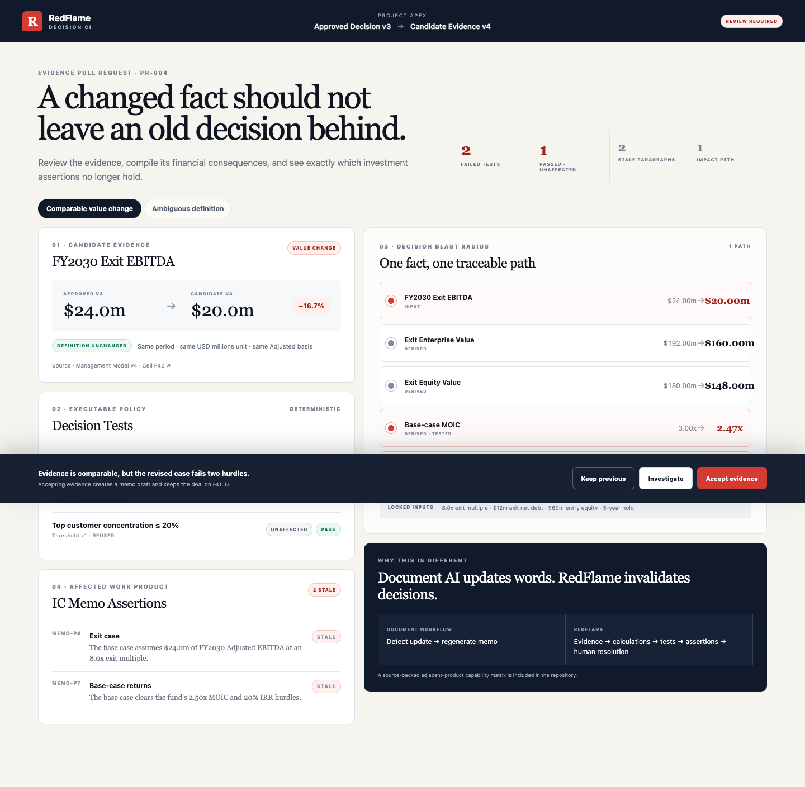

# RedFlame Decision CI

RedFlame is **pull requests and CI tests for investment decisions**.

OpenAI Build Week track: **Work & Productivity**.

When a new seller-model snapshot arrives after an IC memo has been drafted, RedFlame compares the evidence, recompiles only the affected return path, reruns versioned investment hurdles, marks dependent memo assertions stale, and asks a human to resolve the evidence. Accepting evidence never approves the investment.

> Submission status: the public-safe build is deployed at **[redflame-plum.vercel.app](https://redflame-plum.vercel.app)**. Final video, live GPT eval, and Codex `/feedback` ID are not yet available and are not claimed below.



## The three-minute story

1. Approved Decision v3 clears 2.50x MOIC and 20% IRR.
2. Candidate Evidence v4 changes FY2030 Adjusted EBITDA from $24m to $20m.
3. Deterministic code recompiles `$20m × 8.0x − $12m`, producing $148m exit equity.
4. Against locked $60m entry equity, MOIC becomes 2.47x and five-year IRR becomes 19.79%.
5. Both return tests fail. Customer concentration remains `PASS · UNAFFECTED`.
6. Accepting the fact produces a demo-local Resolution Receipt, keeps the deal on `HOLD`, and creates two draft memo revisions.
7. A separate ambiguous-language fixture demonstrates the model boundary: GPT may classify semantic definition changes, but it never calculates or changes a hurdle result.

## Run locally

Requirements: Node.js 22+ and pnpm 11.9.0.

```bash
cd redflame
pnpm install --frozen-lockfile
pnpm dev
```

Open `http://localhost:3000`.

The default public-safe mode does not call a model. Until a real eval runs, it shows a committed fallback labeled `RECORDED EVAL FIXTURE · NOT LIVE`; that fixture is not presented as model-run evidence. `pnpm run eval:live` uses authorized GPT-5.6 access and replaces `evals/live/latest.json` with a timestamped artifact containing the model, response ID, and fixture hash. After that artifact is reviewed and committed, the UI identifies it as a verified recorded eval. To enable the constrained runtime endpoint as well, copy `.env.example` to `.env.local` and configure OpenAI plus Upstash Redis. The endpoint accepts one committed fixture ID, not arbitrary prompts.

## Verification

```bash
pnpm test          # deterministic unit and API contract tests
pnpm run test:e2e  # two Playwright product paths
pnpm run build     # production build
pnpm run eval:live # real model eval; requires OPENAI_API_KEY
pnpm run record:demo # macOS: generate a narrated MP4 from the public app
```

`record:demo` uses Playwright, the macOS `say` command, and ffmpeg (default path `/opt/homebrew/bin/ffmpeg`). It writes an ignored local artifact to `artifacts/redflame-demo.mp4`; override `REDFLAME_URL`, `DEMO_VOICE`, `DEMO_SPEECH_RATE`, or the ffmpeg paths as needed.

Golden outputs:

| Output | Approved v3 | Candidate v4 |
|---|---:|---:|
| Exit EBITDA | $24.00m | $20.00m |
| Exit EV | $192.00m | $160.00m |
| Exit equity | $180.00m | $148.00m |
| MOIC | 3.00x | 2.47x |
| Five-year IRR | 24.57% | 19.79% |
| MOIC hurdle | PASS | FAIL |
| IRR hurdle | PASS | FAIL |
| Customer concentration | PASS | PASS · UNAFFECTED |

This is a simplified no-interim-cash-flow return bridge: one $60m entry outflow, one exit inflow exactly five years later, no interim distributions or additional equity, and $12m of exit net debt. Tests compare unrounded decimal values; displays round half-up.

## Architecture and trust boundary

```text
Known JSON fixtures
  → structured semantic pre-check
  → deterministic return compiler
  → dependency-selected hurdle tests
  → stale memo assertions
  → human evidence resolution
  → demo-local receipt + draft memo
```

Deterministic TypeScript owns all values, units, periods, formulas, dependency traversal, thresholds, PASS/FAIL results, and memo state. GPT is called only for one ambiguous source-language fixture. It returns a bounded reason code, non-numeric explanation, and confidence. Invalid output, low confidence, timeout, missing rate limiting, or missing credentials fails closed to `INVESTIGATE`.

The Resolution Receipt is deliberately labeled **demo-local, unsigned, and not server-persisted**. It proves a complete interaction, not production auditability.

## Adjacent-product capability matrix

This matrix reports only what was found in the linked public product documentation reviewed on July 16, 2026. `Not found` means the reviewed page did not document the capability; it is not a claim that the product lacks it.

| Publicly documented capability | Blueflame | F2 | Omega Intelligence | ReturnCatalyst | RedFlame demo |
|---|---|---|---|---|---|
| Update or rerun work as deal evidence changes | [Running memo updates](https://blueflame.ai/solutions/private-equity) | [Live memos update as assumptions change](https://f2.ai/blog) | [Assumption change tracking](https://omegaintelligence.ai/platform) | [Rerun as diligence lands](https://www.returncatalyst.ai/solutions/ic-memo-automation) | Demonstrated |
| Calculation dependency or formula lineage | Not found on reviewed page | [Formula-level fidelity and cell dependencies](https://f2.ai/private-equity) | Context graph documented; calculation propagation not evaluated | [Model-to-memo references](https://www.returncatalyst.ai/blog/ic-memo-automation) | Demonstrated |
| Versioned executable investment hurdle tests | Not found on reviewed page | Not found on reviewed page | Not found on reviewed page | Not found on reviewed page | Demonstrated |
| Mark dependent memo assertions stale | Not found on reviewed page | Not found on reviewed page | Not found on reviewed page | Referenced locations are traceable; stale state not found | Demonstrated |
| Human Accept / Keep / Investigate evidence resolution | Human review documented; this workflow not found | Not found on reviewed page | [Approvals and reasons tracked](https://omegaintelligence.ai/platform) | Partner review documented; this workflow not found | Demonstrated |

The novelty claim is narrow: RedFlame demonstrates these five capabilities as one evidence-to-decision control loop. It does not claim the adjacent products cannot implement them.

## Impact evidence

**Current status: unvalidated workflow hypothesis.** Direct user validation is in progress. This repository does not claim measured time savings, adoption intent, or user quotations.

The target user is a PE Associate preparing an IC memo who receives a revised seller model and must reconcile the new evidence against returns, hurdle decisions, and memo language. The demo tests whether a visible evidence-to-decision propagation path makes that reconciliation safer and faster. It does not establish market demand.

## Codex usage

[`CODEX.md`](./CODEX.md) records the bounded Codex tasks, files changed, verification commands, real correction, and implementation commit hashes. The required `/feedback` ID remains a submission blocker until generated.

The judge-ready narrative and timed walkthrough are in [`SUBMISSION.md`](./SUBMISSION.md) and [`DEMO_SCRIPT.md`](./DEMO_SCRIPT.md). Entrant-only credential and account steps are isolated in [`FINALIZE.md`](./FINALIZE.md).

## Scope

This hackathon build intentionally does not parse arbitrary Excel files, execute Excel formulas, provide authentication, support multiple users, persist server audit history, edit a full IC memo, or approve an investment. The controlled fixtures validate the decision-propagation mechanism without pretending the ingestion layer is solved.

This repository fork existed before the submission period. The complete `redflame/` application and its evidence trail are new Build Week work on `codex/redflame-decision-ci`; the pre-existing WeKnora product is not claimed as part of the hackathon implementation.

## Submission evidence gate

| Artifact | Status |
|---|---|
| Local production build | PASS |
| GitHub CI | PASS · [run 29515229913](https://github.com/NeoCh3n/PE-WeKnora/actions/runs/29515229913) |
| Deterministic tests | PASS |
| Playwright Accept/HOLD/Receipt/Reset path | PASS |
| Playwright semantic-block path | PASS |
| Resolution Receipt screenshot | PASS · [`docs/resolution-receipt.png`](./docs/resolution-receipt.png) |
| Public Vercel URL | PASS · [redflame-plum.vercel.app](https://redflame-plum.vercel.app) |
| Local narrated demo timing fallback | PASS · 149.1 seconds · 1440×900 · H.264/AAC · regenerate after the real GPT-5.6 eval before submission |
| Timestamped GPT-5.6 eval artifact | MISSING; `evals/live/latest.json` is an explicit placeholder |
| Codex `/feedback` ID | MISSING |
| Public video under three minutes | MISSING; current local MP4 is a timing fallback, not eligibility evidence |
| Direct user validation | MISSING; impact is labeled unvalidated |

## License

RedFlame is provided under the repository's existing license for this hackathon submission.
